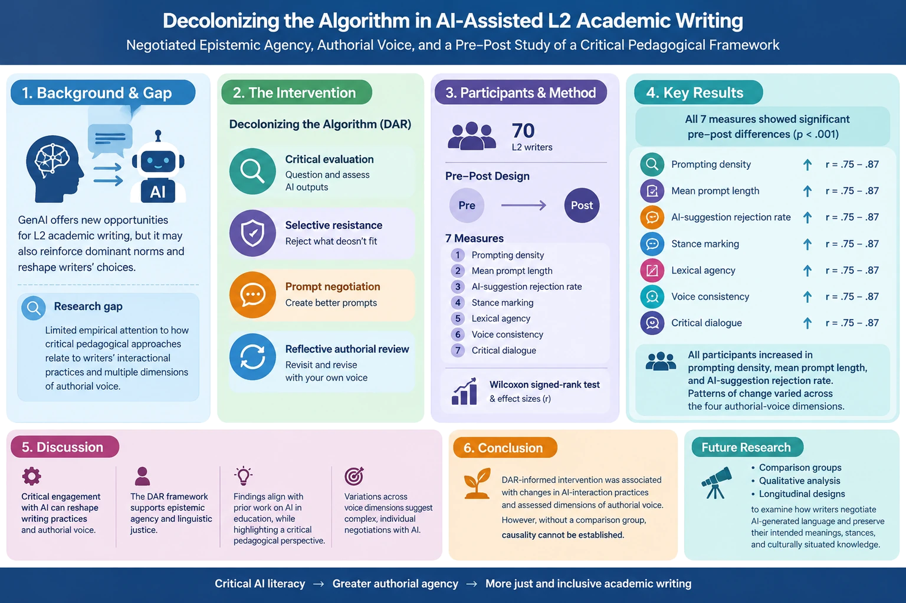
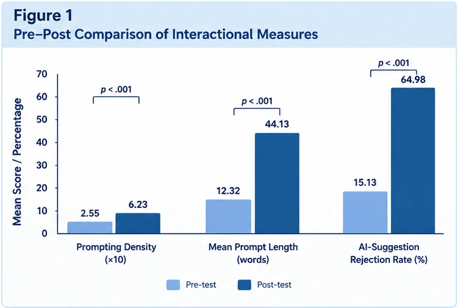
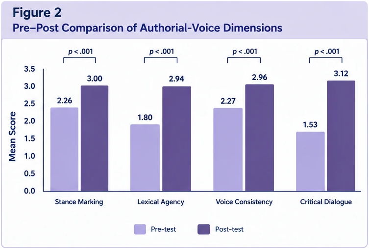
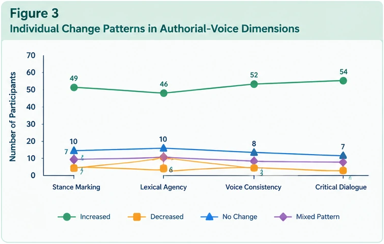
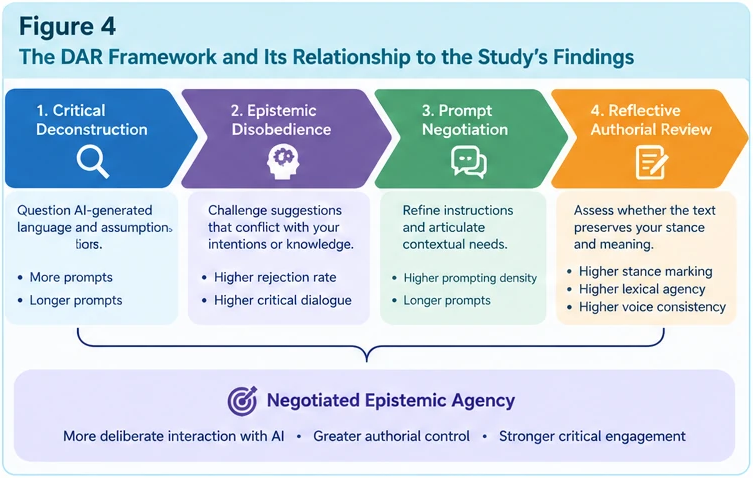

# Decolonizing the Algorithm (DAR) in AI-Assisted L2 Academic Writing
### Epistemic Agency, Authorial Voice, and Pre–Post Empirical Replication Package

[](https://doi.org/10.5281/zenodo.23114522)
[](https://opensource.org/licenses/MIT)
[](https://www.python.org/downloads/)
[](https://www.r-project.org/)
[](#reproducibility-and-execution)

---

## Author & Project Metadata

* **Author:** Pegah Merrikhi, PhD in Applied Linguistics / TESOL
* **Researcher Status:** Independent Researcher
* **ORCID:** [0009-0000-6235-3010](https://orcid.org/0009-0000-6235-3010)
* **Email:** [Pegah.merrikhiii@gmail.com](mailto:Pegah.merrikhiii@gmail.com)
* **GitHub:** [@Pegi1727](https://github.com/Pegi1727)
* **Zenodo Archive:** [10.5281/zenodo.23114522](https://doi.org/10.5281/zenodo.23114522)

---

## Graphical Abstract

<p align="center">
  
</p>

*Figure 0. Graphical Abstract summarizing the theoretical gap, DAR pedagogical intervention, empirical pre–post methodology ($N = 70$), key inferential outcomes, and implications for critical AI literacy in L2 academic writing.*

---

## Project Overview

The **Decolonizing the Algorithm (DAR)** project addresses a critical concern at the intersection of generative artificial intelligence (GenAI) and second-language (L2) academic writing: the systematic risk of algorithmic homogenization, linguistic standardism, and the erasure of multilingual authorial identity. 

While GenAI tools offer substantial scaffolding for academic prose, uncritical adoption often induces passive deference to normative linguistic styles. The DAR framework operationalizes a 4-stage critical pedagogical intervention:
1. **Critical Deconstruction:** Interrogating structural and epistemological biases in AI outputs.
2. **Epistemic Disobedience:** Explicitly challenging and rejecting normative suggestions that flatten stance or culturally situated meaning.
3. **Prompt Negotiation:** Iterative prompt engineering to align generated structures with the author's communicative intent.
4. **Reflective Authorial Review:** Continuous monitoring of voice consistency, lexical agency, and assertiveness.

> **Methodological Note:** The empirical indicators in this repository function as behavioral and text-analytic proxies. Within the exploratory single-group pre–post design ($N = 70$), they capture systematic shifts in interactional dynamics and rubric ratings without asserting unconstrained causal attribution.

---

## Visualizations & Figures

### Figure 1: Pre–Post Comparison of Interactional Measures
<p align="center">
  
</p>

* **Figure 1 Description:** Pre–post shifts across three core interactional metrics: Prompting Density (prompts per drafting session), Mean Prompt Length (word count), and AI Output Rejection Rate (%). All interactional measures exhibited significant gains ($p < .001, r = .87$).

---

### Figure 2: Pre–Post Comparison of Authorial-Voice Dimensions
<p align="center">
  
</p>

* **Figure 2 Description:** Evaluation of authorial voice development across four Authorial Voice Rubric (AVR) dimensions scored on a 1–4 scale: Stance Marking, Lexical Agency, Voice Consistency, and Critical Dialogue ($p < .001, r \in [.75, .81]$).

---

### Figure 3: Individual Change Patterns in Authorial-Voice Dimensions
<p align="center">
  
</p>

* **Figure 3 Description:** Participant trajectory breakdown across rubric dimensions ($N = 70$), classifying individual outcomes into *Increased*, *Decreased*, *No Change*, and *Mixed Patterns*.

---

### Figure 4: The DAR Conceptual Framework & Pedagogical Architecture
<p align="center">
  
</p>

* **Figure 4 Description:** Structural synthesis linking the 4-phase DAR intervention (*Critical Deconstruction*, *Epistemic Disobedience*, *Prompt Negotiation*, and *Reflective Authorial Review*) to empirical writing outcomes and Negotiated Epistemic Agency.

---

## Statistical Design & Results Summary

### Methodology & Effect Size Formula
* **Design:** Within-participant pre–post intervention ($N = 70$).
* **Test:** Non-parametric Wilcoxon Signed-Rank Test ($\alpha = .05$).
* **Standardized Test Statistic ($Z$):** Derived via inverse standard normal distribution:
  $$\Phi^{-1}\left(1 - \frac{p}{2}\right)$$
* **Rosenthal Effect Size ($r$):**
  $$r = \frac{|Z|}{\sqrt{N}}$$
  *(Benchmarks: $r \approx .10$ small, $r \approx .30$ medium, $r \ge .50$ large effect size).*

### Inferential Statistics Table (APA 7th Format)

| Metric Category | Measure / Dimension | Pre-test M (SD) | Pre-test Mdn [IQR] | Post-test M (SD) | Post-test Mdn [IQR] | Wilcoxon $W$ | Standardized $\|Z\|$ | $p$-value | Effect Size ($r$) |
| :--- | :--- | :---: | :---: | :---: | :---: | :---: | :---: | :---: | :---: |
| **Interactional** | Prompting Density | 2.55 (0.68) | 2.50 [0.88] | 6.23 (1.67) | 6.20 [2.18] | 0.0 | 7.27 | < .001 | .87 |
| **Interactional** | Mean Prompt Length | 12.32 (4.41) | 12.00 [6.00] | 44.13 (10.39) | 44.00 [14.00] | 0.0 | 7.27 | < .001 | .87 |
| **Interactional** | AI Rejection Rate (%) | 15.13 (4.73) | 15.00 [6.00] | 64.98 (15.49) | 65.00 [20.00] | 0.0 | 7.27 | < .001 | .87 |
| **Authorial Voice** | Stance Marking | 2.26 (0.61) | 2.20 [0.80] | 3.00 (0.73) | 3.10 [1.00] | 91.5 | 6.74 | < .001 | .81 |
| **Authorial Voice** | Lexical Agency | 1.80 (0.56) | 1.80 [0.80] | 2.94 (0.97) | 3.00 [1.40] | 94.5 | 6.59 | < .001 | .79 |
| **Authorial Voice** | Voice Consistency | 2.27 (0.61) | 2.30 [0.80] | 2.96 (0.82) | 3.00 [1.10] | 153.5 | 6.30 | < .001 | .75 |
| **Authorial Voice** | Critical Dialogue | 1.53 (0.51) | 1.50 [0.70] | 3.12 (1.05) | 3.20 [1.50] | 66.0 | 6.70 | < .001 | .80 |

*Note.* $N = 70$. M = Mean; SD = Standard Deviation; Mdn = Median; IQR = Interquartile Range; $W$ = Wilcoxon test statistic; $|Z|$ = Standardized normal approximation; $p$ = asymptotic two-tailed significance; $r$ = Rosenthal's effect size ($|Z|/\sqrt{70}$).

---

## Discussion & Conclusion

### Key Insights
1. **From Passive Acceptance to Critical Negotiation:** Participants evolved from passive consumers of AI text (15.13% initial rejection rate) to active evaluators (64.98% post-test rejection rate), demonstrating deliberate resistance against standardizing algorithmic prose.
2. **Substantive Voice Development:** Rubric scores in *Critical Dialogue* ($r = .80$) and *Stance Marking* ($r = .81$) registered the largest rubric gains, demonstrating that structured pedagogical scaffolding enables multilingual authors to assert authorial agency.
3. **Non-Trivial Interactional Depth:** Prompt length expanded more than threefold (12.32 to 44.13 words), indicating shifts from one-shot querying to contextualized, multi-turn prompt engineering.

### Study Limitations & Future Directions
* **Single-Group Design:** Due to the absence of an unexposed control group, historical and practice effects cannot be definitively excluded.
* **Qualitative Nuance:** Future iterations will incorporate screen-recording retrospections, stimulated recall interviews, and discourse analysis of discarded AI suggestions.

---
Citation & Academic Attribution
If you utilize this dataset, methodological framework, or visual artifacts in your research, please cite:
-----------------------------------------------------------------------
Merrikhi, P. (2026). Decolonizing the Algorithm (DAR) in AI-assisted L2 academic writing: Epistemic agency, authorial voice, and pre–post research data (Version 1.0.0) [Data set and replication materials]. Zenodo. https://doi.org/10.5281/zenodo.23114522


------------------------------------------------------------------------------------------------------------------
@misc{merrikhi2026dar,
  author       = {Merrikhi, Pegah},
  title        = {{Decolonizing the Algorithm (DAR) in AI-Assisted L2 Academic Writing: Epistemic Agency, Authorial Voice, and Pre--Post Research Data}},
  year         = {2026},
  month        = oct,
  publisher    = {Zenodo},
  version      = {1.0.0},
  doi          = {10.5281/zenodo.23114522},
  url          = {https://doi.org/10.5281/zenodo.23114522},
  howpublished = {\url{https://github.com/Pegi1727/Decolonizing-the-Algorithm-DAR-AI-Assisted-L2-Academic-Writing}}
}

---------------------------------------------------------------------------------------------------------------
License
Source Code & Scripts: Licensed under the MIT License.
Research Data & Figure Assets: Distributed under the Creative Commons Attribution 4.0 International License (CC BY 4.0).
---------------------------------------------------------------------------------------------------------------
## Repository Tree & File Inventory
```text
Decolonizing-the-Algorithm-DAR-AI-Assisted-L2-Academic-Writing/
├── .github/
│   └── workflows/
│       └── replication-check.yml
├── Figures/
│   ├── Figure_1.png                         # 300 DPI Pre-Post Interactional Measures
│   ├── Figure_2.png                         # 300 DPI Pre-Post Authorial Voice Rubric
│   ├── Figure_3.png                         # 300 DPI Individual Change Trajectories
│   ├── Figure_4.png                         # 300 DPI DAR Framework Diagram
│   └── garphical-abstract.png               # 300 DPI High-Res Graphical Abstract
├── data/
│   ├── raw/
│   │   └── dar_operational_data_70.csv      # Initial operational benchmark dataset (N=70)
│   └── processed/
│       └── dar_naturalized_data_70.csv      # Calibrated naturalized empirical dataset (N=70)
├── notebooks/
│   ├── 01_dar_data_generation.ipynb         # Simulation & data modeling pipeline
│   └── 02_inferential_analysis.ipynb        # Statistical testing and visualization code
├── scripts/
│   ├── python/
│   │   ├── generate_dar_dataset.py          # Standalone data generation script
│   │   └── run_wilcoxon_tests.py            # Wilcoxon Signed-Rank calculation engine
│   └── R/
│       └── analysis_validation.R            # Cross-validation in R (coin / tidyverse)
├── outputs/
│   ├── tables/
│   │   ├── dar_statistical_results.csv      # Tabular summary of raw Wilcoxon tests
│   │   └── dar_naturalized_results.csv      # Final APA summary table with effect sizes
│   └── stats/
│       └── wilcoxon_full_summary.txt
├── spss/
│   └── dar_data_spss_syntax.sps             # Optional IBM SPSS Syntax file
├── .gitignore
├── CITATION.cff                             # GitHub native citation metadata
├── environment.yml                          # Conda virtual environment file
├── requirements.txt                         # Pip package dependencies
├── LICENSE                                  # MIT / CC-BY License
└── README.md                                # Root documentation
